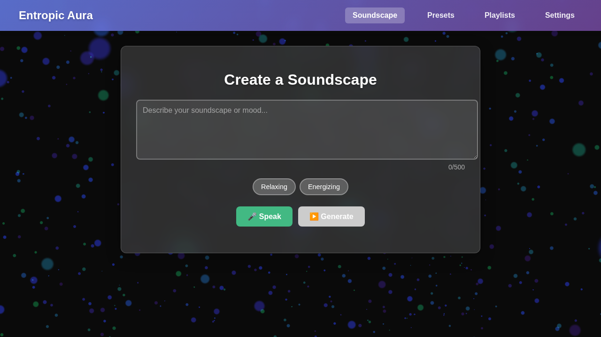
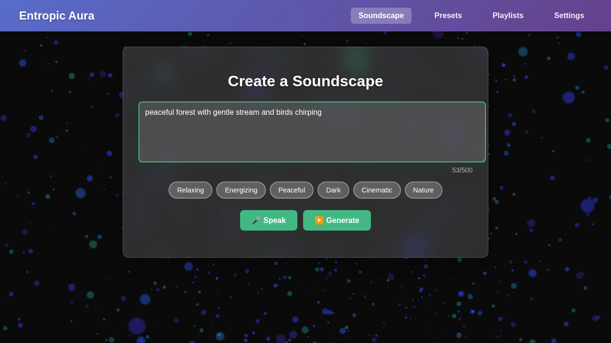
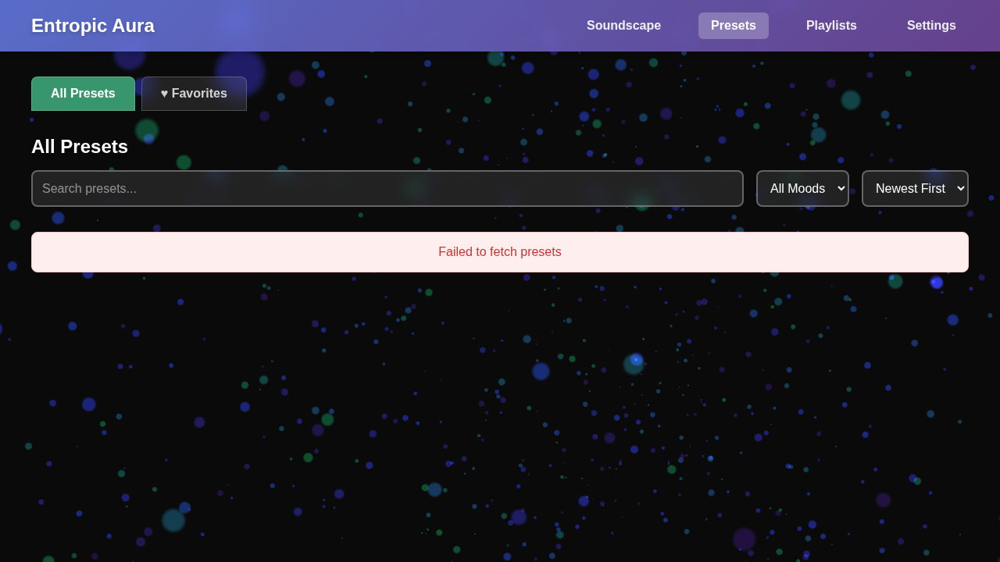
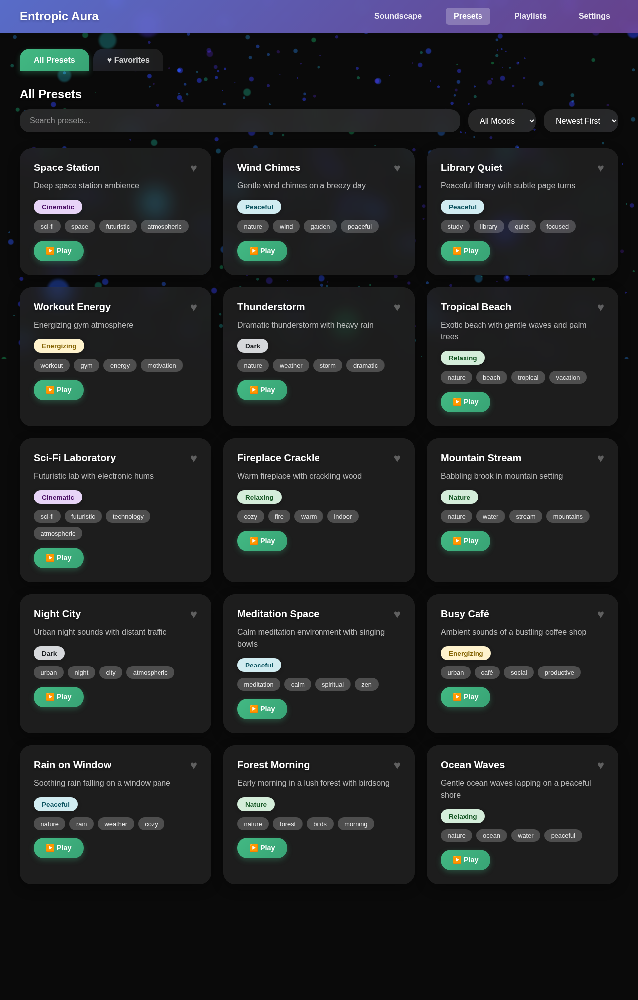
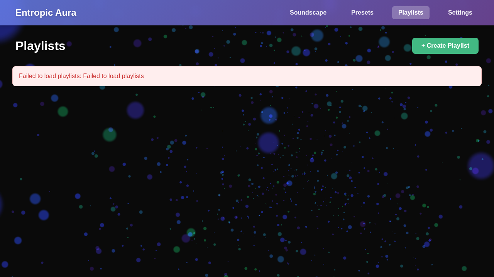
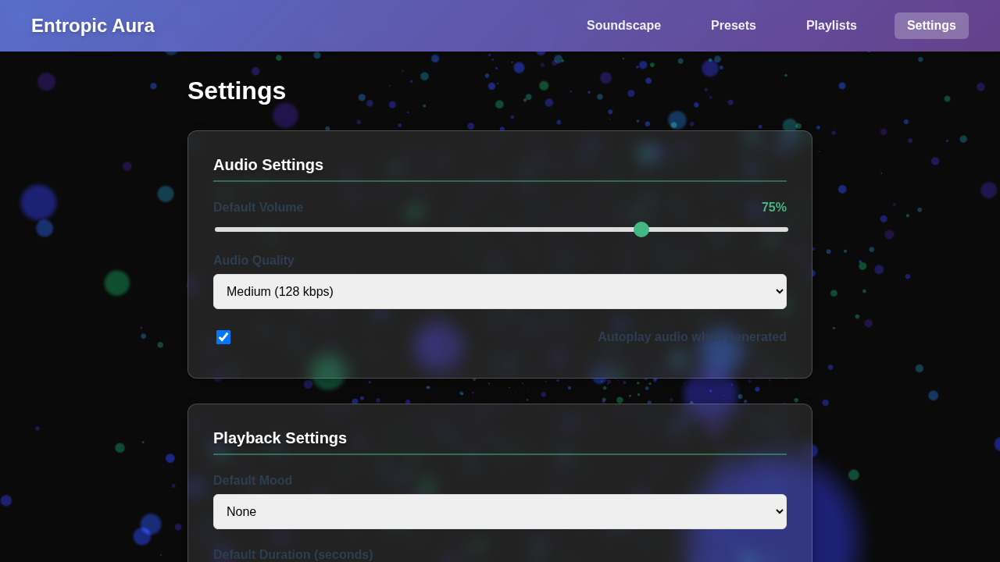

# Entropic Aura

**Entropic Aura** is a live generated atmosphere application that streams continuous audio to users. It uses ComfyUI as a backend to generate ambient soundscapes from presets or user prompts.

## Screenshots

### Soundscape Creator
The main page for creating custom atmospheric soundscapes. This is where the magic happens!



**Features:**
- **Text Prompt Input**: Describe your desired soundscape in natural language (e.g., "peaceful forest with birdsong" or "rain on a tin roof")
- **Voice Input**: Use the microphone button to describe your soundscape with your voice
- **Mood Presets**: Quick selection buttons for common moods (Relaxing, Energizing, Peaceful, Dark, Cinematic, Nature)
- **Audio Player**: Built-in player with play/pause, volume control, and progress tracking
- **4-Channel Audio Mixer**: Advanced mixing controls (expandable under "Advanced Settings")
  - Individual volume sliders for each of 4 audio channels
  - Real-time visualizers showing frequency data for each channel
  - Mute/unmute controls for each channel
  - Master controls to reset all or mute/unmute all channels
- **Save as Preset**: Quickly save your current soundscape configuration for later use



The interface also features a translucent navigation bar that adapts to the current page:


### Preset Manager
Browse, search, and manage your saved atmosphere presets. This is your personal library of soundscapes.



**Features:**
- **Search Bar**: Quick search across preset names, descriptions, and prompts
- **Filter by Mood**: Filter presets by mood tags (Relaxing, Energizing, Nature, etc.)
- **Filter by Tags**: Custom tags to organize your presets
- **Sort Options**: Sort by creation date or popularity (play count)
- **Favorites**: Star your favorite presets for quick access with a dedicated favorites filter
- **Preset Cards**: Each card displays:
  - Preset name and description
  - Mood and custom tags
  - Play count and last played date
  - Quick actions: Play, Edit, Delete, Favorite/Unfavorite
- **Create New**: Button to create a new preset from scratch
- **Grid Layout**: Responsive grid that adapts to your screen size

The preset manager also includes fallback sample data to help you get started:



And features the translucent navigation:


### Playlist Manager
Create and manage playlists that automatically rotate between different atmospheres.



**Features:**
- **Search Playlists**: Find playlists by name or description
- **Create New Playlist**: Build custom playlists with rotation intervals
- **Playlist Cards**: Each card shows:
  - Playlist name and description
  - Number of presets included
  - Rotation settings (interval, shuffle, repeat)
  - Quick actions: Play, Edit, Delete
- **Playlist Editor**: When creating or editing a playlist:
  - Add presets from your preset library
  - Set individual duration for each preset
  - Reorder presets with drag-and-drop
  - Configure global rotation interval (seconds between preset switches)
  - Toggle shuffle mode (randomize preset order)
  - Toggle repeat mode (loop the playlist)
- **Automation**: Playlists automatically switch between presets based on your settings
- **Visual Indicators**: See which preset is currently playing in an active playlist

### Settings
Customize your Entropic Aura experience with comprehensive settings.



**Settings Categories:**
- **Audio Quality**:
  - Bitrate selection (128, 192, 256 kbps)
  - Sample rate (44.1, 48 kHz)
  - Channel configuration (Stereo, 4-Channel)
- **Playback Preferences**:
  - Auto-play next in playlists
  - Crossfade duration
  - Default volume level
  - Pre-load next track option
- **Visualizations**:
  - Enable/disable audio visualizers
  - Visualization style selection
  - Color scheme preferences
- **Data Management**:
  - Export all presets and playlists (JSON format)
  - Import previously exported data
  - Clear all data (with confirmation)
  - View storage usage statistics
- **Appearance**:
  - Theme selection (Light, Dark, Auto)
  - Navigation style preferences
  - Compact mode toggle
- **Advanced**:
  - ComfyUI server connection settings
  - Debug mode toggle
  - Performance monitoring

## Features

### Currently Implemented
- **Live Audio Generation**: Generate atmospheric audio using ComfyUI backend with 4-channel output
- **4-Channel Audio Mixer**: Fine-tune soundscapes with independent volume control for each of the 4 audio channels
- **Advanced Mixer Controls**: Expandable mixer section with per-channel visualizers and mute controls (hidden by default)
- **Text Prompts**: Create soundscapes from text descriptions
- **Mood Presets**: Quick selection of mood-based atmospheres (Relaxing, Energizing, Peaceful, Dark, Cinematic, Nature)
- **Continuous Streaming**: Smooth audio playback via AAC streaming at 128 kbps
- **Multi-Track System**: 4 simultaneous audio tracks with independent generation and volume control
- **Preset Management**: Create, save, edit, and manage custom atmosphere presets
- **Favorites System**: Mark and quickly access favorite presets
- **Playback History**: Track and review recently generated soundscapes
- **Playlist System**: Create playlists that rotate atmospheres at configurable intervals
- **Playlist Automation**: Automatic preset switching with shuffle and repeat modes
- **User Settings**: Customize audio quality, playback preferences, and appearance
- **Data Export/Import**: Backup and restore presets, playlists, and settings

### Planned Features
- **Real-Time Audio Mixing**: Advanced mixing of 4 tracks with dynamic crossfading
- **Enhanced Crossfade Transitions**: Seamless blending between different atmospheres
- **Advanced Audio Effects**: Real-time filter adjustment and custom effect chains

## Architecture

The application consists of:
- **Frontend**: Vue 3 application with PrimeVue UI components
- **Backend**: Node.js server (`backend/server.js`) that interfaces with ComfyUI
- **ComfyUI Integration**: Text-to-audio generation via custom workflow
- **FFmpeg Workers**: Scalable worker pool for audio transcoding (6 instances recommended)

## Requirements

### Frontend app

Front‑end Vue app with a Node.js helper that streams audio generated by a
local [ComfyUI](https://github.com/comfyanonymous/ComfyUI) instance through
an FFmpeg filter chain.

## Prerequisites

- Node.js 20+
- npm

## Setup

1. Install dependencies:
   ```bash
   npm install
   ```
2. (Optional) copy `.env.example` to `.env` and adjust `VUE_APP_BASE_URL` or
   other settings as needed.

## Development

- Front‑end dev server: `npm run dev` (http://localhost:8080)
- Audio backend: `npm run api` (http://localhost:3000)

## COMFY & FFmpeg

The backend calls a ComfyUI server to synthesize audio then pipes it through
`fluent-ffmpeg` with the bundled `ffmpeg-static` binary. Filters apply
compression, a high‑pass, echo and limiter before outputting AAC at 128 kbps.

By default it connects to `127.0.0.1:8188`. Point to another host with the
`COMFY_HOST` environment variable:

```bash
COMFY_HOST=192.168.1.50:8188 npm run api
```

Each worker provides an FFmpeg binary used to transcode and stream audio in
AAC at 128 kbps.

`docker-compose.yml` includes an `ffmpeg-worker` service that supplies FFmpeg
binaries for transcoding. Build and start everything with:

```bash
docker compose up --build
```

1. Navigate in your repo folder: cd `entropic_aura`
2. Install project dependencies: `npm install`
3. Create a new .env file: `cp .env.example .env`
4. `VUE_APP_BASE_URL` should contain the URL of your App
 (eg. http://localhost:8080/)
5. `VUE_APP_API_BASE_URL` should contain the URL of JSON-API server (eg. http://localhost:3000/api/v1)
6. Run `npm run dev` to start the application in a local development environment or `npm run build` to build release distributables.
7. In another terminal, launch the audio backend with `npm run api`.

Integration tests for the backend live in `backend/test/`. Run them with:

```bash
npm test
```

Visit [http://localhost:8080/soundscape](http://localhost:8080/soundscape) and
click **Generate** to hear the streaming result in the built‑in audio player.

Register a user from `#/register` or login using pre-created users for other features.

## 4-Channel Audio Mixer

All generated soundscapes are created with **4 audio channels**, allowing for fine-tuned control over the audio output. The mixer provides:

### Features
- **Individual Channel Control**: Adjust volume for each of the 4 channels independently
- **Real-Time Visualization**: Each channel has its own sound level indicator showing frequency data
- **Mute Controls**: Quickly mute/unmute individual channels
- **Master Controls**: Reset all channels to default or mute/unmute all at once
- **Collapsible Interface**: The mixer is hidden by default under "Advanced Settings" to keep the UI clean

### Usage
1. Generate a soundscape using the Soundscape Creator
2. Once audio starts playing, locate the "Advanced Settings" section below the audio player
3. Click on "▶ Advanced Settings" to expand the mixer controls
4. Use the volume sliders to adjust individual channels (0-100%)
5. Monitor each channel's activity through the colored visualizers:
   - Channel 1: Red
   - Channel 2: Green
   - Channel 3: Blue
   - Channel 4: Yellow

### Technical Details
- Audio is generated with 4 channels in the backend using FFmpeg
- Frontend uses Web Audio API for channel splitting and analysis
- Each channel can be independently controlled without affecting others
- AAC encoding at 128 kbps maintains quality across all channels

## API Reference

### Audio Streaming

#### `GET /api/stream`
Stream generated audio based on text prompt and mood.

**Query Parameters:**
- `text` (required): Text prompt for audio generation (max 500 characters)
- `mood` (optional): Mood preset (Relaxing, Energizing, Peaceful, Dark, Cinematic, Nature)

**Response:** Audio stream (AAC, 128 kbps)

### Track Management

#### `GET /api/tracks`
Get all tracks and track pool status.

**Response:**
```json
{
  "status": {
    "totalTracks": 2,
    "activeTracks": 2,
    "maxTracks": 4,
    "canAddTrack": true,
    "tracksByState": {
      "generating": 1,
      "ready": 1,
      "playing": 0,
      "fading": 0,
      "expired": 0
    }
  },
  "tracks": [...]
}
```

#### `POST /api/tracks`
Create a new audio track.

**Request Body:**
```json
{
  "prompt": "peaceful forest sounds",
  "mood": "Relaxing",
  "volume": 0.8,
  "duration": 45
}
```

**Response:** `201 Created` with track object

#### `GET /api/tracks/:id`
Get specific track by ID.

#### `PATCH /api/tracks/:id`
Update track state or volume.

**Request Body:**
```json
{
  "state": "ready",
  "volume": 0.5
}
```

#### `DELETE /api/tracks/:id`
Remove track from pool.

### Preset Management

#### `GET /api/presets`
Get all presets with optional filters.

**Query Parameters:**
- `mood`: Filter by mood
- `tag`: Filter by tag
- `search`: Search in name, description, and prompt
- `sortBy`: Sort by `popular` or default (creation date)

**Response:**
```json
{
  "presets": [
    {
      "id": "uuid",
      "name": "Ocean Waves",
      "description": "Peaceful ocean sounds",
      "prompt": "gentle ocean waves on beach",
      "mood": "Relaxing",
      "tags": ["nature", "ocean"],
      "parameters": { "duration": 45 },
      "createdAt": "2026-01-11T00:00:00.000Z",
      "updatedAt": "2026-01-11T00:00:00.000Z",
      "timesPlayed": 5,
      "isFavorite": true
    }
  ]
}
```

#### `POST /api/presets`
Create a new preset.

**Request Body:**
```json
{
  "name": "Forest Ambience",
  "description": "Peaceful forest with birds",
  "prompt": "forest with birdsong",
  "mood": "Nature",
  "tags": ["nature", "forest", "birds"]
}
```

**Response:** `201 Created` with preset object

#### `GET /api/presets/:id`
Get specific preset by ID.

#### `PATCH /api/presets/:id`
Update preset fields.

#### `DELETE /api/presets/:id`
Delete preset.

#### `POST /api/presets/:id/play`
Increment play count for preset.

### Favorites

#### `GET /api/favorites`
Get all favorite presets.

#### `POST /api/favorites/:presetId`
Add preset to favorites.

#### `DELETE /api/favorites/:presetId`
Remove preset from favorites.

### Other Endpoints

#### `GET /api/health`
Health check for backend and ComfyUI.

#### `GET /api/moods`
Get list of available mood presets.

#### `GET /api/history`
Get recent soundscape generation history.

**Query Parameters:**
- `limit` (optional): Maximum number of items to return (default: 10)

### Playlist Management

#### `GET /api/playlists`
Get all playlists with optional search.

**Query Parameters:**
- `search` (optional): Search in playlist name or description

**Response:**
```json
{
  "playlists": [
    {
      "id": "uuid",
      "name": "Morning Mix",
      "description": "Energizing morning sounds",
      "presets": [
        {
          "presetId": "preset-uuid",
          "duration": 300,
          "order": 0
        }
      ],
      "rotationInterval": 300,
      "shuffle": false,
      "repeat": true,
      "createdAt": "2026-01-13T00:00:00.000Z",
      "updatedAt": "2026-01-13T00:00:00.000Z"
    }
  ]
}
```

#### `POST /api/playlists`
Create a new playlist.

**Request Body:**
```json
{
  "name": "Evening Relaxation",
  "description": "Calm evening atmospheres",
  "rotationInterval": 300,
  "shuffle": false,
  "repeat": true
}
```

**Response:** `201 Created` with playlist object

#### `GET /api/playlists/:id`
Get specific playlist by ID.

#### `PATCH /api/playlists/:id`
Update playlist properties.

**Request Body:**
```json
{
  "name": "Updated Name",
  "description": "Updated description",
  "rotationInterval": 600,
  "shuffle": true
}
```

#### `DELETE /api/playlists/:id`
Delete playlist.

#### `POST /api/playlists/:id/presets`
Add preset to playlist.

**Request Body:**
```json
{
  "presetId": "preset-uuid",
  "duration": 300,
  "order": 0
}
```

#### `DELETE /api/playlists/:id/presets/:presetId`
Remove preset from playlist.

#### `PUT /api/playlists/:id/reorder`
Reorder presets in playlist.

**Request Body:**
```json
{
  "presetIds": ["preset-uuid-1", "preset-uuid-2", "preset-uuid-3"]
}
```

### Other Endpoints

The project does not persist data on the server. Audio is streamed directly
from ComfyUI to the client and discarded after playback. Client‑side storage
is not implemented beyond what the browser provides.

```
entropic_aura
    ├── index.html 
    ├── public
    │   ├── layout
    │   ├── themes
    │   ├── favicon.png
    │   └── index.html
    ├── src
    │   ├── assets
    │   │   ├── css
    │   │   ├── fonts
    │   │   ├── img
    │   │   ├── js
    │   │   └── scss
    │   ├── components (custom components)
    |   |   └── component-name
    |   ├── layouts (layout blocks)
    |   ├── service (temporary mock data for UI dev)
    |   ├── services (use only these to connect to API!)
    │   ├── mixins
    │   │   ├── formMixin.js
    │   │   └── showSwal.js
    │   ├── router
    |   |    └── index.js
    |   |    └── routes.js (extra routes)
    │   ├── store
    │   │   ├── auth.module.js
    |   |   ├── index.js
    |   |   |── modules
    |   |   |    ├── module-name
    |   |   |── services (extra services, deprecating)
    │   │   └── profile.module.js
    │   ├── views (naming e.g. Profile/EditProfie.vue)
    │   │   ├── components
    │   ├── App.vue
    │   └── main.js
    ├── .browserslistrc
    ├── .whyareyoulookingatthis
    ├── .eslintrc.js
    ├── .gitignore
    ├── babel.config.json
    ├── vue.config.js
    ├── webpack.config.js
    ├── .env.example
    ├── Dockerfile
    ├── vite.config.js
    ├── docker-compose.yml
    ├── package.json
    └── README.md
```

### Backend

An experimental Node.js helper lives in `backend/` and demonstrates how to
call a local [ComfyUI](https://github.com/comfyanonymous/ComfyUI) server to
generate audio and stream it through an FFmpeg filter chain. The helper now
outputs AAC at 128 kbps and is served by `backend/server.js` on `/api/stream`.

Visit [http://localhost:8080/soundscape](http://localhost:8080/soundscape) and
click **Generate** to hear the streaming result in the built‑in audio player.
Adjust `backend/audio-workflow.json` to match your ComfyUI workflow.

## Roadmap

### Phase 1: Core Audio Features (Completed)
- ✅ Basic audio generation from prompts
- ✅ ComfyUI integration
- ✅ Streaming audio playback
- ✅ Mood-based audio filtering
- ✅ Playback history tracking

### Phase 2: Multi-Track System (Completed)
- ✅ Implement 4 simultaneous track generation
- ✅ Track state management (generating, ready, playing, fading, expired)
- ✅ Individual track volume control
- ✅ 4-channel audio generation and mixing
- ✅ Per-channel volume control with visualizers
- ⏳ Real-time audio mixing engine (backend ready, frontend integration pending)
- ⏳ Crossfade transitions between tracks (backend ready, frontend integration pending)

### Phase 3: User Experience (Completed)
- ✅ Preset creation and management system
- ✅ Favorites functionality
- ✅ Search and filter presets
- ✅ Play count tracking
- ✅ Playlist builder with rotation intervals
- ✅ Enhanced audio visualization

### Phase 4: Advanced Features (Completed)
- ✅ Playlist automation and scheduling
- ✅ Audio visualization components
- ✅ User settings and preferences
- ✅ Export/import presets and playlists
- ✅ 4-channel audio mixer with advanced controls
- ⏳ Real-time audio mixing with crossfading (backend infrastructure ready)
